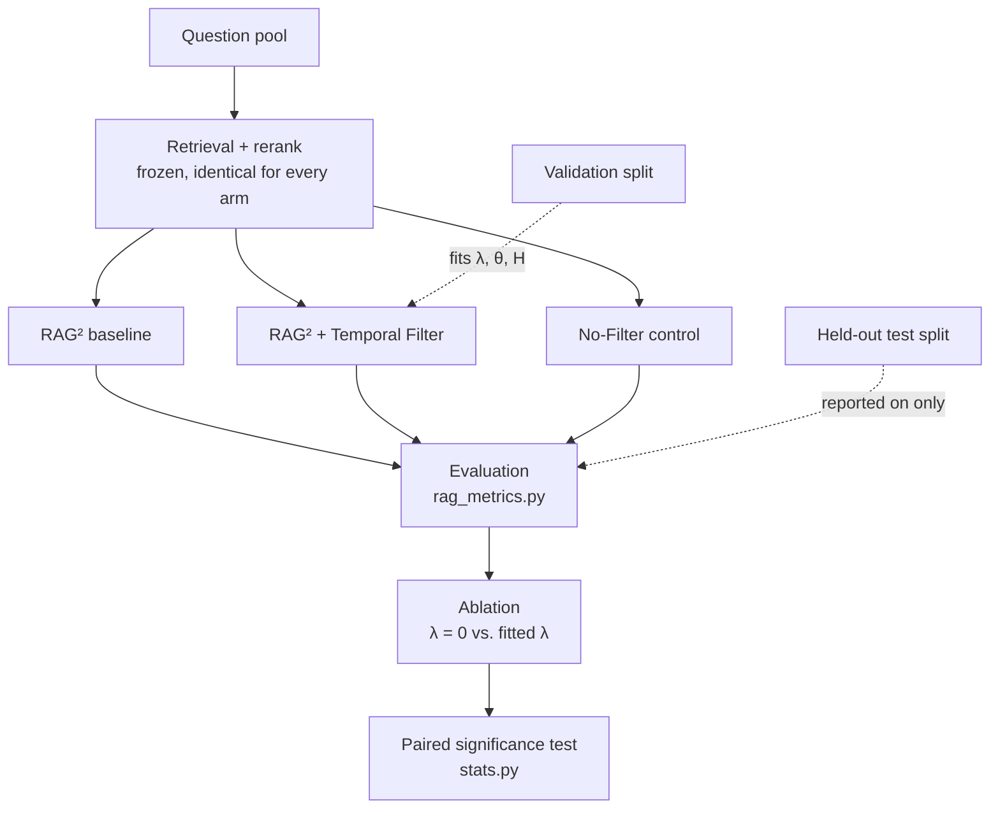

# RAG² + Temporal Filter — Alzheimer's QA thesis

MS thesis implementation. **Research code, not a clinical system** — nothing
here is validated for, or usable in, patient care.

## 1. Research problem

> **Does adding a Temporal Filter to RAG² improve question answering for
> Alzheimer's disease, compared to RAG² alone?**

Medical evidence changes over time — a systematic review's conclusion can be
revised as new trials appear. A retrieval-augmented QA system that judges
passages on relevance alone has no way to prefer the current evidence over
superseded evidence saying something different. This thesis asks whether
giving the system that one additional signal — *how old is this passage,
relative to the question* — measurably improves its answers, and reports the
answer honestly whichever way it comes out.

## 2. Base method — RAG²

RAG² ([Sohn et al., NAACL 2025](https://github.com/dmis-lab/RAG2)) retrieves
passages for a question, then uses a trained filter to decide which ones an
LLM actually gets to see. The filter judges each passage on its text alone —
it never looks at *when* the passage was published. Code: `systems/baseline/`.

## 3. Proposed contribution — Temporal Filter

The same idea as RAG², plus one signal: how old each passage is, relative to
the question. Code: `systems/proposed/`.

```
A(s) = (1 − λ)·ρ(s)  +  λ·T(s, q, t_q)          admit if A(s) ≥ θ
```

| Symbol | Meaning |
|---|---|
| `ρ(s)` | Relevance — the same reranker score RAG² already uses |
| `T(s, q, t_q)` | Temporal score — `2^(−age_days / H)`, 1.0 for a passage published on the question date, halving every `H` days |
| `λ` | How much weight goes to the temporal score vs. relevance (0 to 1) |
| `θ` | Admission threshold — a passage is kept only if `A(s) ≥ θ` |
| `H` | Half-life in days — how fast the temporal score decays |

`λ`, `θ`, `H` are fitted on a validation split, never guessed. `λ = 0` turns
the temporal part off entirely — that is the ablation study's "component
removed" condition.

## 4. Control — No Filter

A third arm that admits every retrieved passage up to the context budget,
with no filtering at all. It shows whether filtering helps at all, so a
result for the Temporal Filter can be read against an honest floor.

| Arm | What it does | Code |
|---|---|---|
| RAG² (baseline) | Flan-T5 filter, text only | `systems/baseline/rag2.py` |
| RAG² + Temporal Filter (proposed) | Same idea + a temporal score | `systems/proposed/` |
| No Filter (control) | Admits everything, up to the budget | `systems/baseline/no_filter.py` |

Retrieval runs **once per question**, is frozen, and every arm sees the
exact same retrieved passages. Only the admission rule differs between arms
— everything else (prompt, context budget, generator, decoding settings) is
identical and checked in code before a run starts
(`experiments/evaluation/runner.py`).

## 5. Methodology



`λ`, `θ` and `H` are grid-searched on a held-out **validation** split and
frozen before anything is measured on the separate **test** split — the
result below is reported on test only, and the parameters were never chosen
by looking at it. Two commands cover this:

```bash
# Fit on validation, report on held-out test (requires the real corpus/index)
python -m experiments.runners.fit_and_evaluate

# Fixture demo of the same pipeline shape (no real corpus needed)
python -m experiments.runners.run_end_to_end
```

Both print two comparisons:
- `main_evaluation` — RAG² vs. the full Temporal Filter.
- `ablation_study` — full Temporal Filter vs. the same system with `λ=0`
  (temporal part switched off).

## 6. Evaluation

Every arm's answers are scored the same way, by
`experiments/evaluation/rag_metrics.py` (token overlap, ROUGE-L, context
precision/recall, groundedness). The **primary** measure for the main
comparison is currency — the mean temporal score `T(s)` of the evidence each
arm actually admitted, on the subset of questions where the underlying
evidence base is known to have changed over time
(`temporal_candidate`) — since that subset is where a temporal signal should
matter if it matters at all. Whether a currency difference is real rather
than noise is decided by a **paired sign test** over per-question outcomes
(`experiments/evaluation/stats.py`), not by the size of the average gap: an
average can look large or small while still being indistinguishable from
chance, and only a significance test can tell the two apart.

## 7. Evaluation status

The evaluation pipeline has been implemented and run end to end. **Results
are not yet reported here**: the run completed so far uses a reduced-scale
setup on the way to the full evaluation, and the comparison this thesis
reports will be the one produced after that setup is brought to full scale
(§9). The table below tracks progress against the two research objectives
rather than stating an outcome.

| Stage | Status |
|---|---|
| Evidence corpus (built, verified, frozen) | Complete |
| Retrieval + reranking pipeline | Implemented, tested, validated end to end |
| RAG² baseline (implementation) | Implemented, tested |
| RAG² baseline (trained filter checkpoint) | Placeholder-scale checkpoint in place; full training pending |
| Temporal Filter (implementation) | Implemented, tested |
| λ / θ / H fitting procedure | Implemented; run once on the reduced-scale setup |
| Held-out test evaluation + ablation | Implemented; run once on the reduced-scale setup |
| Statistical significance testing | Implemented (paired sign test) |
| Full-scale retrieval index | Pending |
| Generative model (in place of the extractive stand-in) | Pending |
| **Reported comparison (Objective 2)** | **Pending full-scale run** |

Every implemented component has a corresponding automated test
(`tests/`), and the pipeline's reduced-scale run is committed at
`experiments/outputs/fit_and_evaluate/` for reproducibility — it is an
engineering checkpoint, not the reported result.

## 8. Completed work

- Alzheimer's evidence corpus built, verified end to end, and frozen
  (`alzheimer_corpus/` — see `docs/status_and_decisions.md` §2).
- Full pipeline (retrieval → admission → generation → evaluation →
  ablation) implemented, tested, and validated end to end, including a
  confirmed real (non-mock) generator run.
- Question pool sourced from real, cited, external sources (Cochrane
  systematic reviews, NIH public-health pages) under a provenance protocol
  that forbids fabricated questions, answers, or citations
  (`docs/research_experimental_specification.md` §13); human-reviewed;
  split into validation and test sets.
- `λ`, `θ`, `H` fitting procedure implemented and exercised on a full,
  real-data run end to end, scored by a pre-registered primary metric and
  judged by a paired significance test rather than an arbitrary magnitude
  threshold — see §7.

## 9. Next phase

To move from the reduced-scale pipeline validation (§7) to a reportable
comparison against Objective 2, the following reductions are removed one at
a time, in order of expected impact: the retrieval index is built over the
full frozen corpus rather than the current pilot slice, and the RAG²
baseline filter checkpoint is trained to completion rather than on a reduced
label set. Both steps are scoped and already implemented end-to-end; neither
requires new methodology. See `docs/status_and_decisions.md` §3.2 for the
ordered list of remaining steps.

## 10. Where the active code is

```
alzheimer_corpus/    the evidence corpus (PMC-based), COMPLETE / FROZEN
systems/             RAG² baseline, Temporal Filter, No-Filter control
experiments/         retrieval, question pool, evaluation, and
                     runners/ — fit_and_evaluate.py (real data) and
                     run_end_to_end.py (fixture demo / --real-model)
tests/               unit + integration tests for all of the above
docs/                four documents — see below
```

| Document | Read it for |
|---|---|
| [`docs/current_objectives.md`](docs/current_objectives.md) | **Canonical scope** — the research question, the three objectives, current status. Start here. |
| [`docs/research_experimental_specification.md`](docs/research_experimental_specification.md) | **The method** — every arm's exact behaviour, the parameters, the generator, metrics, statistics, and how to reproduce a run. |
| [`docs/question_review.md`](docs/question_review.md) | Instructions for reviewing the candidate question pool. |

`docs/status_and_decisions.md` is an internal engineering/development log
(component readiness, environment notes, a dated change log) kept for
reproducibility detail; it is not required reading for understanding the
research.

## 11. Where archived/superseded work is

`_archive/` holds work that is not part of the active methodology, kept for
history rather than for use — see `_archive/README.md` for what each piece
was and why it was moved. Nothing in the active pipeline depends on it
(verified by an automated import check, `tests/unit/test_scope_invariants.py`).

## 12. How to run

```bash
# Run every test (unit + integration)
python -m unittest discover -s tests -t .

# Fixture demo: all three arms, evaluation, and the ablation sweep
python -m experiments.runners.run_end_to_end

# Real data: fit on validation, report on held-out test
python -m experiments.runners.fit_and_evaluate --device cpu
```
