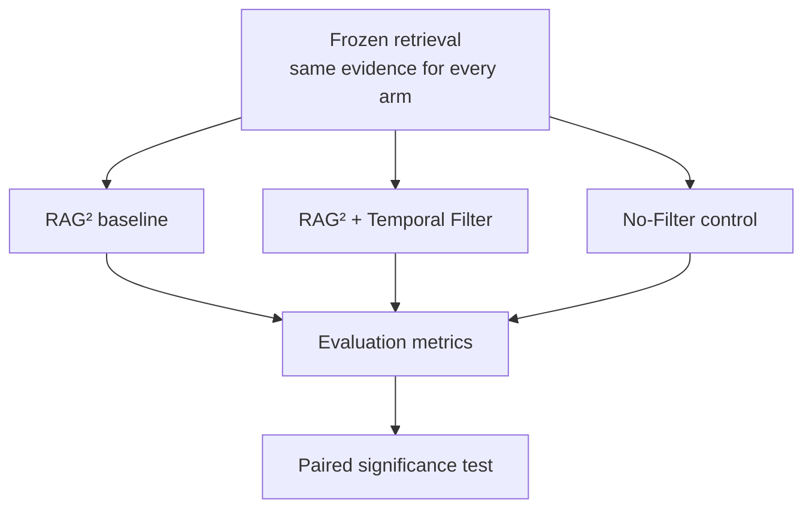

# Temporal Evidence Filtering in Retrieval-Augmented Generation: Extending RAG² for Alzheimer's Disease Question Answering

## 1. Problem Statement

Medical evidence changes over time: a systematic review's conclusion can be
revised as new trials appear, and a body of evidence that was once current
can later be superseded. A retrieval-augmented question-answering (RAG)
system whose evidence-admission mechanism judges passages on textual
relevance alone has no way to prefer current evidence over superseded
evidence saying something different — it treats an outdated and a current
passage as equally admissible if both are topically relevant. RAG²
(Sohn et al., NAACL 2025) exemplifies this: it trains a filter to decide
which retrieved passages an LLM sees, but that filter never looks at *when*
a passage was published.

## 2. Research Motivation and Objectives

If how current the evidence is genuinely affects answer quality in a domain
where the evidence base is actively revised — Alzheimer's disease research
is one such domain — then a retrieval-augmented system that is blind to
publication date is leaving a usable signal unused. This motivates adding one signal to
an existing, published RAG method and testing, rather than assuming,
whether it helps.

**Research objectives:**

1. To implement and validate the proposed RAG system using predefined
   evaluation metrics for retrieval and generation performance.
2. To determine the extent to which the proposed RAG system improves
   retrieval and generation performance compared with the baseline model.

Both objectives are addressed by direct comparison, ablation, and a
significance test — not by assuming an improvement and reporting only
favourable numbers. Full methodological detail is in `docs/methodology.md`.

## 3. Methodology and Proposed Architecture

**Baseline**: RAG² — retrieval, then a trained Flan-T5 filter that admits or
rejects each candidate passage from text alone.

**Proposed system**: the same retrieval and the same filtering shape, with
one added signal — how old each passage is relative to the question:

```
A(s) = (1 − λ)·ρ(s)  +  λ·T(s, q, t_q)          admit if A(s) ≥ θ
```

| Symbol | Meaning |
|---|---|
| `ρ(s)` | Relevance — the same reranker score the baseline already uses |
| `T(s, q, t_q)` | Temporal score, `2^(−age_days / H)` |
| `λ`, `θ`, `H` | Temporal weight, admission threshold, half-life — fitted on a validation split, never guessed |

**Control**: a No-Filter arm that admits every retrieved passage up to the
context budget — the honest floor a filtering method must clear.



Each arm receives identical retrieved evidence; the admission rule is the
only thing that differs between them. `λ`, `θ`, `H` are fitted on a
validation split beforehand and only ever reported on a separate, held-out
test split; the ablation (`λ = 0`) is the Temporal Filter arm run a second
time with the temporal term switched off, scored the same way.

Retrieval runs once per question and is frozen — every arm sees the exact
same retrieved passages, so only the admission rule differs between them.
Full detail, including exactly what is held constant and how that is
enforced in code: `docs/methodology.md`. Term definitions:
`docs/glossary.md`.

## 4. Evaluation and Experimental Design

Every arm is scored on the same metrics (`docs/evaluation.md`): currency
(the primary measure — mean temporal score of admitted evidence, on
questions where the evidence base is known to have changed) plus standard
RAG diagnostics (token F1, ROUGE-L, context precision/recall, groundedness).
Whether a difference between systems is real, rather than noise, is decided
by a **paired significance test** over per-question outcomes — not by the
size of an average gap.

## 5. Expected Contribution

If the full-scale evaluation shows a significant, consistent advantage for
the Temporal Filter, this work contributes a validated, minimal extension
to RAG² — one additional signal, one additional weight — with evidence that
evidence-currency awareness measurably improves retrieval-augmented QA in a
domain where evidence is actively revised. If it does not, this work still
contributes a rigorously validated pipeline (implementation, statistical
methodology, and an honestly reported negative or inconclusive result) and
a clear account of which factors (corpus scale, baseline strength,
generator fidelity) would need to change to test the idea more
conclusively. Either outcome directly answers Objective 2; this repository
does not commit in advance to which one it will report.

## Repository structure

```
research-repository/
├── README.md
├── pyproject.toml
├── docs/                methodology, data, glossary, evaluation, reproducibility
├── corpus/               the evidence corpus: data/ config/ logs/ metadata/ reports/ scripts/
├── src/
│   ├── common/            shared interfaces (Evidence, Generator, Retriever, System)
│   ├── baseline/          RAG² baseline + No-Filter control
│   └── proposed/          the Temporal Filter
├── evaluation/            metrics, freezing, the comparison runner, statistics
│   └── tests/             unit + integration tests for the whole repository
└── experiments/
    ├── shared/            question pool, retrieval pipeline, runners — used identically by every arm
    ├── baseline/          RAG² filter training (baseline-specific, not shared)
    └── results/           committed run output
```

`_archive/` (not shown above — not part of the active pipeline) holds
superseded/reference material kept for history rather than for use — see
`_archive/README.md`. Nothing in the active pipeline depends on it (verified
by an automated import check, `evaluation/tests/unit/test_scope_invariants.py`).

| Document | Read it for |
|---|---|
| [`docs/methodology.md`](docs/methodology.md) | The experimental method — every arm's behaviour, parameters, generator contract |
| [`docs/data.md`](docs/data.md) | The corpus and question pool — provenance, status, limitations |
| [`docs/glossary.md`](docs/glossary.md) | Term definitions used consistently throughout |
| [`docs/evaluation.md`](docs/evaluation.md) | Metrics, statistical procedure, evaluation status |
| [`docs/reproducibility.md`](docs/reproducibility.md) | Install, test, and run instructions; what is reduced-scale and why |

## How to run

```bash
# Run every test (unit + integration)
python -m unittest discover -s evaluation/tests -t .

# Fixture demo: all three arms, evaluation, and the ablation sweep
python -m experiments.shared.runners.run_end_to_end

# Real data: fit on validation, report on held-out test
python -m experiments.shared.runners.fit_and_evaluate --device cpu
```
