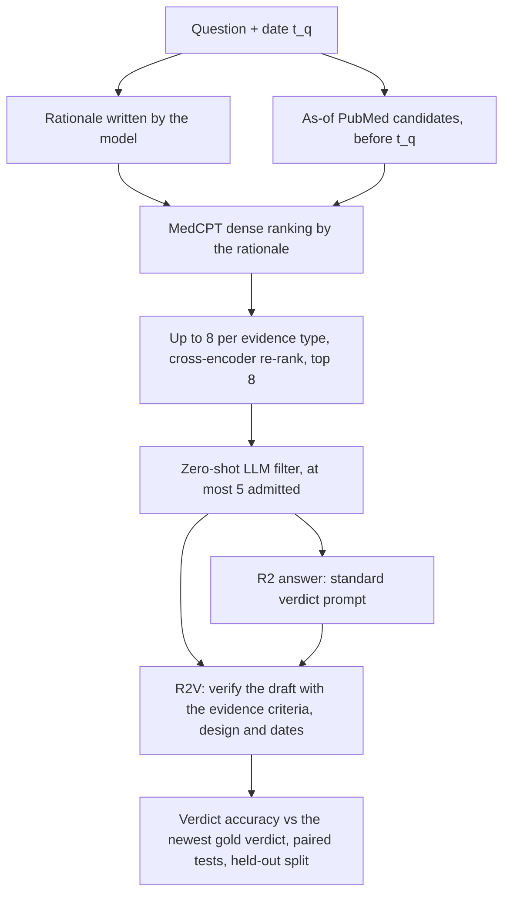

# Improving Retrieval-Augmented Medical Question Answering

## 1. Problem Statement

Retrieval-augmented generation (RAG) is meant to keep a language model's
answers grounded and current, but two failures remain: answers that the
retrieved evidence does not support, and answers that repeat a conclusion the
literature has since revised. RAG² (Sohn et al., NAACL 2025) addresses evidence
quality with three components — a rationale written by the model as the
retrieval query, retrieval balanced across corpora, and a filter that removes
unhelpful passages — but it decides *which* passages the model reads, not *how*
the model reads them, and it never looks at when a passage was published. On
medical questions whose Cochrane verdict changed between review versions, a
small local model given as-of evidence answers SUPPORTED from studies that do
not test the question's intervention or outcome, calls null or placebo-like
results "not enough information", and almost never says REFUTED, even when
its candidate evidence includes studies from the period in which the verdict
changed.

## 2. Research Motivation and Objectives

The work began by adding recency to evidence admission (stage 1, the Temporal
Filter) and then a per-paper evidence-synthesis layer (stage 2). Both were
tested before being believed, and neither beat standard retrieval on the
development split; on the held-out split, retrieval itself raised accuracy
by only +1.5 points, which could not be distinguished from no effect. A
diagnosis of those results (`docs/experimentation.md` §2) found the bottleneck
in the verdict decision, not in retrieval: the model's notion of the three
verdicts differs from the benchmark's definitions, and indirect evidence is read
as support. Date-based admission had nothing to act on, because newer studies
exist for changed and unchanged questions alike. The study was therefore
realigned around one requirement agreed with the supervisor: the proposed
system must improve verdict accuracy by at least 1 percentage point over an
adapted RAG² baseline, genuinely and reproducibly. The primary question is
whether **evidence-criteria verification** — a second pass that checks the
baseline's answer against the evidence using explicit evidence criteria
(directness, study design, the meaning of each verdict, and the currency of the
evidence) — achieves that. The test bed is MedChangeQA (Vladika et al., EMNLP
2025 Findings): Cochrane questions asked as of the newest review's date with
only earlier evidence available. Alzheimer's disease, the domain of the
research proposal, has its own held-out test set: 208 Cochrane questions on
Alzheimer's disease and dementia from reviews that are in neither development
nor held-out split, built the same way and run once after the design is frozen,
as a secondary evaluation. None of its questions has a changed verdict.

**Research objectives:**

1. To implement and validate the proposed system using predefined
   evaluation metrics for retrieval and generation performance.
2. To determine the extent to which the proposed system improves
   retrieval and generation performance compared with relevant baseline
   models and existing works.

Both objectives are addressed by direct comparison, controls, ablations,
and significance tests — not by assuming an improvement and reporting only
favourable numbers. Full methodological detail is in `docs/methodology.md`.

## 3. Methodology and Proposed Architecture

**The baseline — adapted RAG² (R2).** RAG²'s three components are kept in kind
and adapted to what can be run on one laptop: (1) *rationale-based query
formulation*: the generator writes a short rationale (population, intervention,
comparison, outcome, then what is known) and the rationale, not the question,
is the MedCPT dense query; (2) *balanced retrieval*: with one dated corpus
(PubMed, as of the question date), the balance is across evidence types —
systematic reviews, trials and other designs — up to 8 of each, re-ranked by
the MedCPT cross-encoder against the question; (3) *filtering*: RAG²'s trained
filter is not distributed and a local retraining attempt failed (`docs/log.md` Phases 13–18), so
the generator itself judges each of the top 8 abstracts ("does it help answer
the question?"); RAG² reports that a GPT-4o filter matched its trained one, and
a local 8B judge is a weaker substitute; at most 5 pass. The answer uses the benchmark's standard verdict prompt. This is
**not** a RAG² reproduction: the corpus, the filter and the task differ
(`docs/methodology.md`, deviation register).

**The proposed component — evidence-criteria verification (R2V).** The same
model reads R2's answer as a draft, together with the admitted abstracts
labelled with study design and publication year, and checks it against fixed
criteria: only direct studies count; randomised trials and systematic reviews
weigh most; SUPPORTED means at least partial benefit even with low certainty,
REFUTED means no benefit, an effect like placebo, or harm, and NOT ENOUGH
INFORMATION is only for questions without direct studies; when direct studies
disagree, newer evidence takes precedence over older evidence it may have
superseded. It answers in three lines: the direct studies, what they found, the
final verdict.

| Arm | What it is | Role |
|---|---|---|
| B0 / B1 | no evidence / standard RAG (question query, top 5) | references |
| **R2** | adapted RAG² | **baseline** |
| R2-RQ, R2-BR, R2-NF | R2 without rationale query / balancing / filter | ablations |
| R2C | R2's evidence read once with the criteria (no draft) | criteria control |
| **R2V** | R2's answer verified against the evidence with the criteria | **proposed** |
| R2V-ND | R2V without dates and without the currency criterion | temporal ablation |


```mermaid
flowchart TD
    Q[Question + date t_q] --> C[As-of PubMed candidates, before t_q]
    Q --> RA[Rationale written by the model]
    RA --> D[MedCPT dense ranking by the rationale]
    C --> D
    D --> BAL[Up to 8 per evidence type, cross-encoder re-rank, top 8]
    BAL --> FI[Zero-shot LLM filter, at most 5 admitted]
    FI --> A[R2 answer: standard verdict prompt]
    FI --> V[R2V: verify the draft with the evidence criteria, design and dates]
    A --> V
    V --> E[Verdict accuracy vs the newest gold verdict, paired tests, held-out split]
```

The earlier stages remain part of the record. Stage 1, the Temporal Filter,
added a recency term to a relevance score; recency-aware retrieval is an
established idea (e.g. TempRALM), so no novelty is claimed for the formula, and
it did not beat standard retrieval (`docs/experimentation.md` §13). Stage 2's
evidence-synthesis layer failed its development check and was not run on the
held-out split. Verification, criteria prompting and self-checking are
established techniques too; the contribution claimed is their adaptation to
as-of medical evidence and an honest, controlled measurement of what they add
to an adapted RAG² baseline.

## 4. Evaluation and Experimental Design

Every arm is scored on the same metrics (`docs/experimentation.md` §6–§7). The primary
outcome is **verdict accuracy**: the answer's verdict (SUPPORTED / REFUTED /
NOT ENOUGH INFORMATION), parsed from a fixed verdict line with no judge model,
against the newest Cochrane review's verdict. Generation is also measured by
accuracy on changed and unchanged questions, per-class recall, macro-F1, the
outdated-verdict rate, and two automatic indicators of unsupported answers:
mentions of years later than the question date, and decisive verdicts that
cite none of the admitted studies. Retrieval is measured separately: how much
is admitted, of which evidence types, how recent, how much from the update
window, its overlap with standard retrieval and, optionally, its directness as
judged by an independent model. Whether a difference is real is decided by a
**paired significance test** (exact McNemar with a bootstrap interval; Holm for
secondary comparisons) over per-question outcomes — not by the size of an
average gap.

The proposed system is developed on the 226-question development split and
tested once on the held-out split of 528 questions, after its design is frozen
and committed. The requirement is read in advance: *met and confirmed* when the
improvement is at least 1 percentage point and the test separates it from zero,
*met as a point estimate, not confirmed* when it is at least 1 point but the
test cannot separate it from zero, and *not met* otherwise. A 1-point
difference cannot be confirmed with 528 questions: only effects of about 4–6
percentage points or more can, so the point estimate is reported with its
interval. The same rule is applied, as a secondary result, to the 208
Alzheimer's/dementia questions, where only effects of about 6–10 points can be
confirmed. Settings, prompts and decision rules are fixed before any result in
`docs/experimentation.md`.

## 5. Expected Contribution

If the held-out evaluation confirms that evidence-criteria verification beats
the adapted RAG² baseline — and the controls show how much of the gain comes
from the criteria themselves and how much from verifying a draft — this work
contributes evidence that checking a small model's answer against explicit
evidence criteria reduces unsupported verdicts in medical RAG. If the gain is
at least 1 point but not confirmed, it contributes an estimate with its
interval and a clear account of the sample size needed to settle it. If there
is no gain, it contributes a rigorously validated as-of benchmark and pipeline,
an adapted RAG² baseline with component ablations, and an honestly reported
negative result on recency, evidence synthesis and verification for small local
models. Each outcome answers Objective 2; this repository does not commit in
advance to which one it will report.

## Results

Results of record (`docs/experimentation.md` §13–§14): on the development split,
neither recency-aware admission (the Temporal Filter) nor the evidence-synthesis
layer beat standard retrieval. On the held-out split, run once, standard
retrieval raised verdict accuracy by +1.5 points over no evidence (95% CI −2.8
to +6.1, not confirmed) and by +3.1 points on the questions whose verdict
changed (−2.5 to +8.5); the +8.6 points seen on the development split did not
replicate. Another model reproduces 81.4% of the gold labels, which bounds what
any accuracy here can mean.

**Realigned study, held-out split (528 questions, run once; `RAG2_FINDINGS.md`).** Verdict accuracy: no evidence
46.6%, standard retrieval 48.1%, adapted RAG² baseline (R2) 48.7%, proposed evidence-criteria verification (R2V)
50.0%. The requirement is read on R2V − R2 = **+1.3 points** (95% CI −1.9 to +4.7; exact McNemar p = 0.51):
**met as a point estimate, not confirmed**. On the 353 questions whose verdict changed the difference is +3.4
points (−0.8 to +7.4), also not confirmed. On the development split R2V − R2 was −0.4 points (the dev check
failed on direction; the single allowed prompt revision was not used, so the design was frozen as it stood). The
local 8B systems score at or below several closed-book models from the benchmark release answering the same
questions (e.g. Qwen2.5-7B and GPT-4o-mini 52.8%), which is context, not a controlled comparison. The
Alzheimer's/dementia set has not been run yet. Tables: `experiments/medchange/results/report/REPORT.md`.

## Repository structure

```
research-repository/
├── README.md
├── pyproject.toml
├── docs/                 protocol and evaluation, methodology, data, glossary, reproducibility, dated log
├── src/
│   ├── common/           the Evidence / Candidate record types
│   └── temporal_filter/  the Temporal Filter formula (stage 1, a result of record)
├── evaluation/
│   ├── stats.py          exact McNemar, paired bootstrap interval, Holm correction
│   └── tests/            the active test suite and the hermetic-run check
├── experiments/
│   └── medchange/        the pipeline: as-of benchmark, adapted RAG², verification, earlier stages, analysis,
│                         and results/ (the committed outputs)
```

The first, Alzheimer's-specific design (a local corpus, a reviewed question pool and a three-arm runner) and the
other abandoned directions (the RAG² filter retraining, the first pilot) were kept in an `_archive` folder until
2026-10-06, when nothing in the pipeline needed them any more and they were removed. They remain in Git history:
`git show 5e03540:_archive/README.md` describes them, and `git checkout 5e03540 -- _archive` restores the folder.

| Document | Read it for |
|---|---|
| [`docs/methodology.md`](docs/methodology.md) | The experimental method — every arm's behaviour, parameters, generator contract |
| [`docs/data.md`](docs/data.md) | The datasets — the MedChange benchmark, the Alzheimer's/dementia test set, the superseded corpus and pool: provenance, limitations |
| [`docs/related_work.md`](docs/related_work.md) | Positioning against the literature; what is and is not compared with existing models and works |
| [`docs/glossary.md`](docs/glossary.md) | Term definitions used consistently throughout |
| [`docs/reproducibility.md`](docs/reproducibility.md) | Install, test, and run instructions; what is reduced-scale and why |
| [`docs/experimentation.md`](docs/experimentation.md) | Protocol and evaluation in one: requirement, diagnosis, benchmark, systems, metrics, statistics, gates, decision rules, results |
| [`experiments/medchange/results/report/REPORT.md`](experiments/medchange/results/report/REPORT.md) | Result tables and figures in the base paper's layout, for the held-out split of the stage-1/2 run (the development version's data is `report_data_dev.json` beside it) |
| [`docs/log.md`](docs/log.md) | Chronological record of implementation work, decisions, and pilot results |

## How to run

```bash
# Install (numpy only; the model backends come with the extras, see docs/reproducibility.md) and run every active test
pip install -e .
python -m unittest discover -s evaluation -t .

# Primary pipeline (MedChange as-of benchmark); steps and costs: docs/reproducibility.md
python -m experiments.medchange.build_benchmark --medchange-dir ../MedChange

# Realigned study (adapted RAG² + evidence-criteria verification): the dev phase, then, after your go, the held-out phase
python -m experiments.medchange.rag2_pipeline dev --model-path models/Meta-Llama-3-8B-Instruct-Q4_K_M.gguf --commit
python -m experiments.medchange.rag2_pipeline confirm --go --model-path models/Meta-Llama-3-8B-Instruct-Q4_K_M.gguf --commit
# Alzheimer's/dementia secondary test set: build it once, then run it once after the freeze
python -m experiments.medchange.ad_benchmark --medchange-dir ../MedChange
python -m experiments.medchange.rag2_pipeline ad --go --model-path models/Meta-Llama-3-8B-Instruct-Q4_K_M.gguf --commit

# Earlier stages (results of record): python -m experiments.medchange.pipeline status
```
