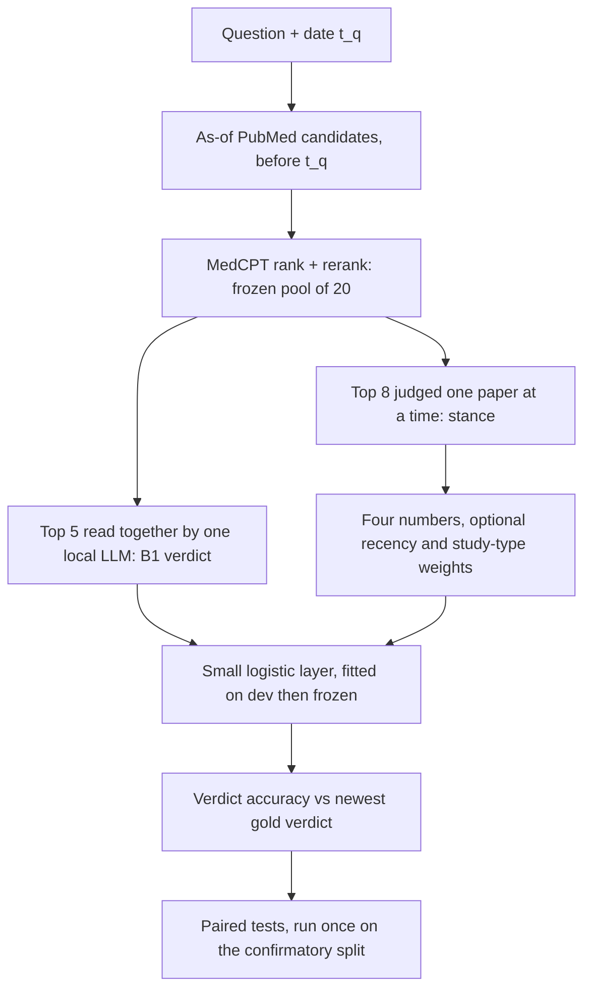

# Evidence-Aware Synthesis for Retrieval-Augmented Medical Question Answering: An As-Of Evaluation on Cochrane Verdict Changes

## 1. Problem Statement

Medical evidence changes over time: a systematic review's conclusion can be
revised as new trials appear, and a body of evidence that was once current
can later be superseded. A retrieval-augmented question-answering (RAG)
system whose evidence-admission mechanism judges passages on textual
relevance alone has no way to prefer current evidence over superseded
evidence saying something different — it treats an outdated and a current
passage as equally admissible if both are topically relevant. RAG²
(Sohn et al., NAACL 2025) exemplifies this: it trains a filter to decide
which retrieved passages an LLM sees, but that filter never looks at *when*
a passage was published. A second weakness sits after admission: a small
local language model that reads several abstracts at once tends to answer
"supported" by default and is sensitive to the order of the passages, so even
well-chosen evidence is used unreliably. The risk is an answer that states a
conclusion the literature has since revised.

## 2. Research Motivation and Objectives

If how current the evidence is genuinely affects answer quality in a domain
where the evidence base is actively revised, then a retrieval-augmented
system that is blind to publication date is leaving a usable signal unused.
This motivated a first stage: adding one recency signal to evidence
admission (the Temporal Filter) and testing, rather than assuming, whether it
helps. On the development split it did not: the mechanism worked (more of the
admitted passages came from after the previous review) but verdict accuracy
did not improve, and an error analysis showed that the weak point is how the
generator uses the evidence, not which evidence is retrieved. A second stage
therefore asks two pre-specified questions about evidence use. RQ1: does
as-of retrieved evidence make a small local model's verdicts more accurate
than no evidence? RQ2: does an evidence-synthesis layer — one narrow stance
judgement per retrieved paper, combined with the RAG answer by a small fixed
model, optionally weighting newer and stronger studies more — improve on the
same RAG answer? The primary test bed is MedChangeQA (Vladika et al., EMNLP
2025 Findings): Cochrane questions whose verdict changed between review
versions, asked as of the newest review's date with only earlier evidence
available. Alzheimer's disease, the original domain, is retained as a
secondary case study.

**Research objectives:**

1. To implement and validate the proposed system using predefined
   evaluation metrics for retrieval and generation performance.
2. To determine the extent to which the proposed system improves
   retrieval and generation performance compared with relevant baseline
   models and existing works.

Both objectives are addressed by direct comparison, controls, an ablation,
and significance tests — not by assuming an improvement and reporting only
favourable numbers. Full methodological detail is in `docs/methodology.md`.

## 3. Methodology and Proposed Architecture

**Stage 1 — the Temporal Filter (done on the dev split; negative result)**:
evidence admission that adds one signal — how recent each passage is relative
to the question date — to a relevance score:

```
A(s) = (1 − λ)·ρ(s)  +  λ·T(s, q, t_q)          T = 2^(−age_days / H)
```

| Symbol | Meaning |
|---|---|
| `ρ(s)` | Relevance — a within-pool rank, normalised to [0, 1] |
| `T(s, q, t_q)` | Temporal score, `2^(−age_days / H)`; `t_q` is the question date |
| `λ`, `H` | Temporal weight (0.5) and half-life (1,095 days); fixed in advance, not tuned |

Stage-1 arms (identical frozen candidate pool, at most 5 admitted passages,
one local LLM, one prompt, greedy decoding):

| Arm | Admission | Role |
|---|---|---|
| B0 | none | the model's own knowledge |
| B1 | cross-encoder top-5 | standard RAG |
| B2 | zero-shot helpfulness top-5 | RAG²-inspired, untrained |
| B3 | cross-encoder + recency | published-style recency reranking |
| **P** | helpfulness + recency | stage-1 proposed system |
| C1 | as P with dates shuffled | falsification control |

**Stage 2 — the evidence-synthesis layer (pre-specified; pilot passed, dev run pending)**: the
generator still reads the same five passages (B1). In addition, the first eight
candidates of the pool are judged one paper at a time, twice with two differently worded prompts whose answers are averaged (does this study's result
support the claim, contradict it, or say nothing clear?), the eight judgements are
condensed into four numbers (signed stance, share without a clear stance,
conflict, amount of informative evidence) with optional recency and study-type
weights, and a small logistic regression fitted once on the dev split and then
frozen combines them with B1's verdict. Stage-2 arms: B1R (B1's verdict through
the same fitting, the fairness control), S0–S3 (stance alone, with no weights /
recency / study type / both), H0–H3 (hybrid with B1's verdict) and H1C, H3C (dates
shuffled, falsification controls).


```mermaid
flowchart TD
    Q[Question + date t_q] --> C[As-of PubMed candidates, before t_q]
    C --> F[MedCPT rank + rerank: frozen pool of 20]
    F --> R[Top 5 read together by one local LLM: B1 verdict]
    F --> S[Top 8 judged one paper at a time: stance]
    S --> W[Four numbers, optional recency and study-type weights]
    R --> L[Small logistic layer, fitted on dev then frozen]
    W --> L
    L --> E[Verdict accuracy vs newest gold verdict]
    E --> T[Paired tests, run once on the confirmatory split]
```

Retrieval runs once per question and is frozen — every arm sees the same
candidates, so only the use of the evidence differs between them. Full detail,
including exactly what is held constant and how that is enforced in code:
`docs/methodology.md`. Term definitions: `docs/glossary.md`.

Recency-aware retrieval is an established idea (e.g. TempRALM), so no novelty
is claimed for the formula; per-paper stance classification and logistic
stacking are standard techniques, so none is claimed for them either. The
contribution is a controlled as-of evaluation and an honest measurement of
whether recency, study type and stance synthesis help. RAG²'s trained filter
is not distributed and a local retraining attempt failed (archived), so B2
and P use an untrained Flan-T5 helpfulness score as a stand-in and are
**not** a RAG² reproduction (`docs/methodology.md`, deviation register).

## 4. Evaluation and Experimental Design

Every arm is scored on the same metrics (`docs/evaluation.md`). The primary
outcome is **verdict accuracy**: the answer's verdict (SUPPORTED / REFUTED /
NOT ENOUGH INFORMATION), parsed from a fixed `VERDICT:` line with no judge
model, against the newest Cochrane review's verdict. Key secondary measures
are the outdated-verdict rate, accuracy on unchanged control questions and
the recall of each verdict class. Retrieval-level measures (such as the share
of admitted passages from the update window) are manipulation checks, never
outcomes. Whether a difference between systems is real, rather than noise, is
decided by a **paired significance test** (exact McNemar, Holm-corrected) over
per-question outcomes — not by the size of an average gap.

Stage 2 is tested once, on a held-out confirmatory split (528 questions that
informed no design decision), after a pilot and a dev check, both machine-evaluated, with pre-stated
pass/fail gates. The primary family is RQ1 (B1 vs B0) and RQ2 (the selected
hybrid vs B1R); a result counts as confirmed only if the corrected p is below
.05 and the interval excludes zero. With 528 questions only effects of about
5 percentage points or more can be confirmed, so a smaller gain would be
reported as an estimate with its interval, not as an improvement. Settings,
gates and decision rules are fixed before any result in
`docs/experiment_plan.md`.

## 5. Expected Contribution

If the confirmatory evaluation shows a significant, consistent advantage for
the evidence-synthesis layer over the same RAG answer — and not for the
shuffled-date controls where recency is used — this work contributes evidence
that decomposing evidence reading improves a small local model's verdicts. If
RQ1 holds but RQ2 does not, it contributes an as-of demonstration that
retrieval helps such a model, mostly by enabling appropriate abstention,
together with the negative stage-1 result on recency and an error analysis of
where answers go wrong. If neither holds, it still contributes a rigorously
validated as-of benchmark and pipeline, an honestly reported negative or
inconclusive result, and a clear account of which factors (label quality,
generator strength, baseline fidelity) would need to change to test the idea
more conclusively. Either outcome directly answers Objective 2; this
repository does not commit in advance to which one it will report. Status
(2026-10-03): the pipeline, the stage-1 dev study (gate G3 failed; standard RAG
was the most accurate arm) and the stage-2 code are built and unit-tested; the
stage-2 pilot passed its machine checks (no human labelling is used anywhere: gold-label reliability and answer consistency are audited by an independent model), the dev run has not been done and the confirmatory split has not been
touched (`docs/log.md`, Phases 25–27).

## Repository structure

```
research-repository/
├── README.md
├── pyproject.toml
├── docs/                methodology, data, glossary, evaluation, reproducibility
├── corpus/               the evidence corpus: data/ config/ logs/ metadata/ reports/ scripts/
├── src/
│   ├── common/            shared interfaces (Evidence, Generator, Retriever, System)
│   ├── baseline/          RAG² baseline + No-Filter control
│   └── proposed/          the Temporal Filter
├── evaluation/            metrics, freezing, the comparison runner, statistics
│   └── tests/             unit + integration tests for the whole repository
└── experiments/
    ├── medchange/         primary pipeline: as-of benchmark, arms, generation, stance, synthesis, analysis
    ├── shared/            question pool, retrieval pipeline, framework demo runner
    └── results/           gitignored retrieval indexes
```

`_archive/` (not shown above — not part of the active pipeline) holds
superseded/reference material kept for history rather than for use — see
`_archive/README.md`. Nothing in the active pipeline depends on it (verified
by an automated import check, `evaluation/tests/unit/test_scope_invariants.py`).

| Document | Read it for |
|---|---|
| [`docs/methodology.md`](docs/methodology.md) | The experimental method — every arm's behaviour, parameters, generator contract |
| [`docs/data.md`](docs/data.md) | The corpus and question pool — provenance, status, limitations |
| [`docs/glossary.md`](docs/glossary.md) | Term definitions used consistently throughout |
| [`docs/evaluation.md`](docs/evaluation.md) | Metrics, statistical procedure, evaluation status |
| [`docs/reproducibility.md`](docs/reproducibility.md) | Install, test, and run instructions; what is reduced-scale and why |
| [`docs/experiment_plan.md`](docs/experiment_plan.md) | The protocol: benchmark, arms, settings, gates, decision rules |
| [`docs/log.md`](docs/log.md) | Chronological record of implementation work, decisions, and pilot results |

## How to run

```bash
# Run every test (unit + integration)
python -m unittest discover -s evaluation -t .

# Fixture demo: all three arms, evaluation, and the ablation sweep
python -m experiments.shared.runners.run_end_to_end

# Primary pipeline (MedChange as-of benchmark); steps and costs: docs/reproducibility.md
python -m experiments.medchange.build_benchmark --medchange-dir ../MedChange

# Stage 2, automated: the dev phase (stance, audits, fit, gate 2, report), then, after your go, the confirmatory phase
python -m experiments.medchange.pipeline dev --model-path models/Meta-Llama-3-8B-Instruct-Q4_K_M.gguf --judge-path models/<qwen>.gguf --medchange-dir ../MedChange --commit
python -m experiments.medchange.pipeline confirm --go --model-path models/Meta-Llama-3-8B-Instruct-Q4_K_M.gguf --judge-path models/<qwen>.gguf --medchange-dir ../MedChange --commit
```
