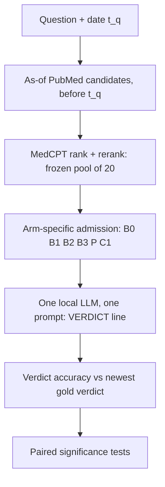

# Time-Aware Evidence Admission in Retrieval-Augmented Medical Question Answering: Mitigating Outdated Conclusions under Evidence Revision

## 1. Problem Statement

Medical evidence changes over time: a systematic review's conclusion can be
revised as new trials appear, and a body of evidence that was once current
can later be superseded. A retrieval-augmented question-answering (RAG)
system whose evidence-admission mechanism judges passages on textual
relevance alone has no way to prefer current evidence over superseded
evidence saying something different — it treats an outdated and a current
passage as equally admissible if both are topically relevant. RAG²
(Sohn et al., NAACL 2025) exemplifies this: it trains a filter to decide
which retrieved passages an LLM sees, but that filter never looks at *when*
a passage was published. The risk is an answer that states a conclusion the
literature has since revised.

## 2. Research Motivation and Objectives

If how current the evidence is genuinely affects answer quality in a domain
where the evidence base is actively revised, then a retrieval-augmented
system that is blind to publication date is leaving a usable signal unused.
This motivates adding one signal to evidence admission and testing, rather
than assuming, whether it helps. The primary test bed is MedChangeQA
(Vladika et al., EMNLP 2025 Findings): Cochrane questions whose verdict
changed between review versions, asked as of the newest review's date with
only earlier evidence available. Alzheimer's disease, the original domain,
is retained as a secondary case study.

**Research objectives:**

1. To implement and validate the proposed system using predefined
   evaluation metrics for retrieval and generation performance.
2. To determine the extent to which the proposed system improves
   retrieval and generation performance compared with relevant baseline
   models and existing works.

Both objectives are addressed by direct comparison, controls, an ablation,
and significance tests — not by assuming an improvement and reporting only
favourable numbers. Full methodological detail is in `docs/methodology.md`.

## 3. Methodology and Proposed Architecture

**Proposed system (the Temporal Filter)**: evidence admission that adds one
signal — how recent each passage is relative to the question date — to a
relevance score:

```
A(s) = (1 − λ)·ρ(s)  +  λ·T(s, q, t_q)          T = 2^(−age_days / H)
```

| Symbol | Meaning |
|---|---|
| `ρ(s)` | Relevance — a within-pool rank, normalised to [0, 1] |
| `T(s, q, t_q)` | Temporal score, `2^(−age_days / H)`; `t_q` is the question date |
| `λ`, `H` | Temporal weight (0.5) and half-life (1,095 days); fixed in advance, not tuned |

**Arms** (identical frozen candidate pool, at most 5 admitted passages, one
local LLM, one prompt, greedy decoding):

| Arm | Admission | Role |
|---|---|---|
| B0 | none | the model's own knowledge |
| B1 | cross-encoder top-5 | standard RAG |
| B2 | zero-shot helpfulness top-5 | RAG²-inspired, untrained |
| B3 | cross-encoder + recency | published-style recency reranking |
| **P** | helpfulness + recency | proposed |
| C1 | as P with dates shuffled | falsification control |


```mermaid
flowchart TD
    Q[Question + date t_q] --> C[As-of PubMed candidates, before t_q]
    C --> F[MedCPT rank + rerank: frozen pool of 20]
    F --> A[Arm-specific admission: B0 B1 B2 B3 P C1]
    A --> G[One local LLM, one prompt: VERDICT line]
    G --> E[Verdict accuracy vs newest gold verdict]
    E --> S[Paired significance tests]
```

Retrieval runs once per question and is frozen — every arm sees the same
candidates, so only the admission rule differs between them. Full detail,
including exactly what is held constant and how that is enforced in code:
`docs/methodology.md`. Term definitions: `docs/glossary.md`.

Recency-aware retrieval is an established idea (e.g. TempRALM), so no novelty
is claimed for the formula; the contribution is a controlled as-of evaluation
and an honest measurement of whether the signal helps. RAG²'s trained filter
is not distributed and a local retraining attempt failed (archived), so B2
and P use an untrained Flan-T5 helpfulness score as a stand-in and are
**not** a RAG² reproduction (`docs/methodology.md`, deviation register).

## 4. Evaluation and Experimental Design

Every arm is scored on the same metrics (`docs/evaluation.md`). The primary
outcome is **verdict accuracy**: the answer's verdict (SUPPORTED / REFUTED /
NOT ENOUGH INFORMATION), parsed from a fixed `VERDICT:` line with no judge
model, against the newest Cochrane review's verdict. Key secondary measures
are the outdated-verdict rate and accuracy on unchanged control questions.
Retrieval-level measures (such as the share of admitted passages from the
update window) are manipulation checks, never outcomes. Whether a difference
between systems is real, rather than noise, is decided by a **paired
significance test** (exact McNemar, Holm-corrected) over per-question
outcomes — not by the size of an average gap. Settings and decision gates are
fixed before any result in `docs/experiment_plan.md`.

## 5. Expected Contribution

If the confirmatory evaluation shows a significant, consistent advantage for
the Temporal Filter over standard RAG, helpfulness ranking and a
published-style recency reranking — and not for the shuffled-date control —
this work contributes evidence that recency-aware admission measurably
improves the currency of retrieval-augmented medical answers. If it does not,
this work still contributes a rigorously validated as-of benchmark and
pipeline, an honestly reported negative or inconclusive result, and a clear
account of which factors (label quality, generator strength, baseline
fidelity) would need to change to test the idea more conclusively. Either
outcome directly answers Objective 2; this repository does not commit in
advance to which one it will report. Status (2026-10-02): the pipeline is
built and unit-tested; gates G0 and G2 have passed. On the dev split
(151 changed questions) the proposed system did not beat its comparators:
gate G3 failed, and the proposed system was less accurate than standard RAG
(`docs/log.md`, Phase 25). The confirmatory split has not been run.

## Repository structure

```
research-repository/
├── README.md
├── pyproject.toml
├── docs/                methodology, data, glossary, evaluation, reproducibility
├── corpus/               the evidence corpus: data/ config/ logs/ metadata/ reports/ scripts/
├── src/
│   ├── common/            shared interfaces (Evidence, Generator, Retriever, System)
│   ├── baseline/          RAG² baseline + No-Filter control
│   └── proposed/          the Temporal Filter
├── evaluation/            metrics, freezing, the comparison runner, statistics
│   └── tests/             unit + integration tests for the whole repository
└── experiments/
    ├── medchange/         primary pipeline: as-of benchmark, arms, generation, analysis
    ├── shared/            question pool, retrieval pipeline, framework demo runner
    └── results/           gitignored retrieval indexes
```

`_archive/` (not shown above — not part of the active pipeline) holds
superseded/reference material kept for history rather than for use — see
`_archive/README.md`. Nothing in the active pipeline depends on it (verified
by an automated import check, `evaluation/tests/unit/test_scope_invariants.py`).

| Document | Read it for |
|---|---|
| [`docs/methodology.md`](docs/methodology.md) | The experimental method — every arm's behaviour, parameters, generator contract |
| [`docs/data.md`](docs/data.md) | The corpus and question pool — provenance, status, limitations |
| [`docs/glossary.md`](docs/glossary.md) | Term definitions used consistently throughout |
| [`docs/evaluation.md`](docs/evaluation.md) | Metrics, statistical procedure, evaluation status |
| [`docs/reproducibility.md`](docs/reproducibility.md) | Install, test, and run instructions; what is reduced-scale and why |
| [`docs/experiment_plan.md`](docs/experiment_plan.md) | The protocol: benchmark, arms, settings, gates, decision rules |
| [`docs/log.md`](docs/log.md) | Chronological record of implementation work, decisions, and pilot results |

## How to run

```bash
# Run every test (unit + integration)
python -m unittest discover -s evaluation -t .

# Fixture demo: all three arms, evaluation, and the ablation sweep
python -m experiments.shared.runners.run_end_to_end

# Primary pipeline (MedChange as-of benchmark); steps and costs: docs/reproducibility.md
python -m experiments.medchange.build_benchmark --medchange-dir ../MedChange
```
