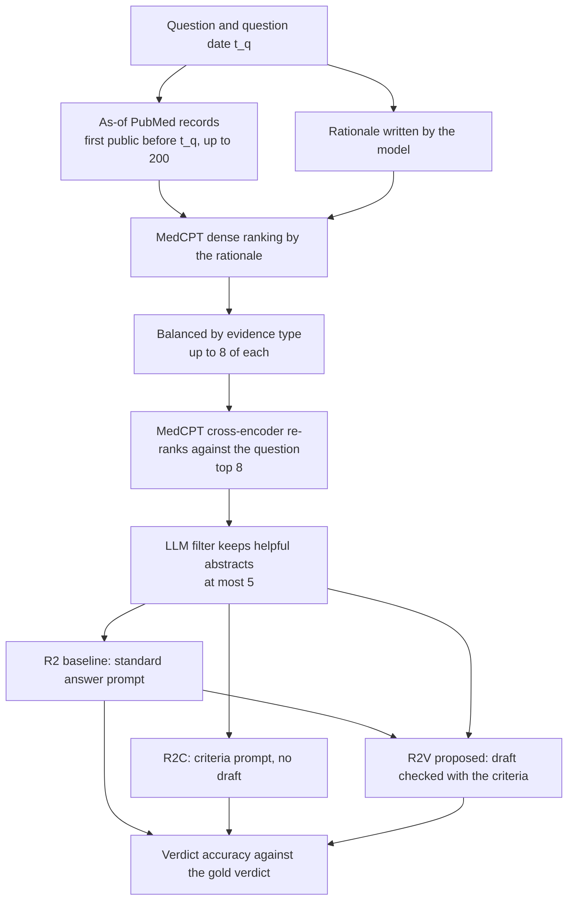

# Methodology

This document explains what the study does and why, from the task to the systems compared: how a question becomes an
answer, how the adapted RAG² baseline works, what the proposed verification step adds, which controls isolate its
effect, which models are used, and what the earlier, superseded approaches were. It is written for a technically
competent reader who is new to retrieval-augmented generation.

Companion documents: `protocol.md` (the fixed design, decision rules and decision ledger), `evaluation.md` (metrics,
statistics, interpretation rules and results), `data.md` (datasets), `reproducibility.md` (commands and costs),
`log.md` (dated history). Numbers are *measured* (this project's runs), *computed* (from files in this project) or
*estimated* (derived from a measurement).

## 1. The problem in plain words

**The task.** A medical question is posed as a claim ("is treatment X effective for outcome Y in population Z?") and a
system must answer with one of three *verdicts*: SUPPORTED (the evidence supports the claim), REFUTED (it shows no
benefit, an effect like placebo, or harm) or NOT ENOUGH INFORMATION. The reference ("gold") verdict is the one stated in
the conclusions of a Cochrane systematic review, a review that pools all trials on a question. In the benchmark used
here (MedChange; `data.md`) a model, gpt-4o-mini, turned each review's conclusions into a verdict label. When a review
is updated its conclusion sometimes changes, so the benchmark holds questions whose verdict *changed* between review
versions and control questions whose verdict never changed.

**Retrieval-augmented generation (RAG).** A language model answers from what it memorised in training, which may be
incomplete or out of date. RAG first searches a document collection for passages related to the question and gives the
best few to the model together with the question, so the answer can rest on documents. Three things can go wrong:
the search returns passages that do not address the question; the model reads the passages badly (for example, treats a
study of another drug as support); or the evidence itself is outdated.

**"As of a date".** Each question is asked as of the date of the newest Cochrane review that answers it, called the
question date *t_q*. Only PubMed records that were first public before *t_q* may be used, and Cochrane records are
excluded, so no system can read the review it is being tested against or anything published after it. Every system
therefore sees only what the review's authors could have seen.

**What the study tests.** The requirement agreed with the supervisor is that the proposed system improves verdict
accuracy by at least 1 percentage point over an adapted RAG² baseline, genuinely and reproducibly. The proposed system
is a second reading step, *evidence-criteria verification*, applied to the baseline's answer (§6). How the requirement
is read, and what can be concluded from a given sample size, is fixed in `protocol.md` §1 and `evaluation.md` §§4–5.

## 2. Study design at a glance

**Two evaluation settings.**

| | MedChange as-of benchmark (general medicine; the realigned study's primary test) | Secondary: dementia and Alzheimer's set (split `ad`) |
|---|---|---|
| Questions | 754 usable Cochrane questions: 504 whose verdict changed between review versions, 250 unchanged controls. Development split (`dev`) 226, held-out split (`confirm`) 528 | 208 questions from 159 reviews that are in neither split, on dementia, Alzheimer's disease, mild cognitive impairment or cognitive decline. All have unchanged verdicts (202 come from reviews with a single version) |
| Question date | the newest review's publication date | the same |
| Evidence | PubMed abstracts first public strictly before the question date | the same |
| Use | the held-out split is the primary test, run once after the design was frozen | run once after the freeze, as a secondary result; completed (`evaluation.md` §6.6) |

The research aims at Alzheimer's disease; an Alzheimer's-specific question set was specified on 2026-10-09 and its construction was stopped
at gate 1 (`protocol.md` §8), so both settings above are the evidence there is, and neither is Alzheimer's-specific.

**The comparison in one line.** Every system answers the same questions with the same generator, decoding and candidate
records. The baseline systems differ in *what* they read (B0, B1, R2); the R2 family differs only in *how* the same
evidence is read (R2, R2C, R2V, R2V-ND).

| System | What it is | Role |
|---|---|---|
| B0 | the model answers without evidence | reference |
| B1 | standard RAG: the question as query, the top 5 abstracts | reference |
| **R2** | **adapted RAG²**: rationale query, balanced retrieval, LLM filter, standard answer prompt (§5) | **baseline** |
| R2C | R2's evidence, read once with the evidence criteria | criteria control |
| **R2V** | R2's answer checked against the evidence with the criteria (§6) | **proposed system** |
| R2V-ND | R2V without dates and without the currency criterion | temporal ablation |
| R2-RQ, R2-BR, R2-NF | R2 without the rationale query / the balancing / the filter | ablations of the baseline (§7); optional, **not run** |

## 3. Shared steps: from a question to candidate evidence

### 3.1 Benchmark and gold verdict

`build_benchmark.py` rebuilds MedChangeQA from the authors' release and refuses to continue unless all 512 released items
are reproduced. It attaches the dates of both review versions, removes 8 changed items whose two conclusions are
near-identical text (label noise) and samples 250 unchanged controls. The splits are seeded and stratified (`data.md` §1).

### 3.2 As-of candidate records

`pubmed_asof.py` (needs network access) searches PubMed for each question. The query is the question's content words (stop
words removed, at most 8) joined with AND; if that finds fewer than 30 records the words are joined with OR instead. PubMed's
publication-date filter is set to the day before *t_q*, the Cochrane Database is excluded, and the first 200 records in
PubMed's relevance order are kept. PubMed dates can be imprecise ("2012 Oct", "2012 Winter"), so each record gets *bounds* on
when it first became public, and a record is kept only if the *latest* date it could have appeared is on or before *t_q*:
uncertain boundary records are dropped, never admitted. Abstracts are fetched through the same service; records without an
abstract of at least 200 characters, and retractions, errata, comments, editorials, letters, news items and patient handouts,
are not eligible. *Computed:* a development question has on average 140 eligible records (median 158, minimum 22) and a
held-out question 148 (median 169, minimum 4).

### 3.3 The retrieval models

MedCPT (Jin et al., 2023), trained by NCBI on PubMed search logs, supplies three models: a *query encoder* and an *article
encoder* that turn text into vectors, so that relevance is the similarity of two vectors (*dense retrieval*, fast), and a
*cross-encoder* that reads the question and one article together and returns a relevance score (slower and more accurate, used
to *re-rank* a short list). Retrieval uses no other model.

### 3.4 The frozen pool of 20

`freeze_candidates.py` builds, once per question, the pool used by B0, B1 and the earlier stages: it ranks the eligible records
by dense similarity to the *question*, re-ranks the top 50 with the cross-encoder, and keeps the best 20 with their date bounds
and an order-sensitive hash. The R2 family starts one step earlier, from the same as-of records (§5).

## 4. Standard answering: B0 and B1

All systems that answer in the standard way use one prompt (`prompts.py`): the question, an optional evidence block
(`[1] Title. Abstract` for each admitted abstract, without dates), the instruction to decide whether current evidence
SUPPORTS, REFUTES or gives NOT ENOUGH INFORMATION, a first line of the form `VERDICT: <label>`, and a justification in
at most three sentences. The verdict is read from that line by a regular expression, never inferred from the prose; an
answer without one counts as wrong and is reported separately. There is no judge model on the primary path.

* **B0** gets no evidence block: the model answers from its own knowledge.
* **B1** (standard RAG) gets the first 5 abstracts of the frozen pool in cross-encoder order.

B0 and B1 answers were generated once per split (`generate_answers.py`) and are reused by every later comparison.

## 5. The baseline: adapted RAG² (R2)

### 5.1 RAG² as published

RAG² (Sohn et al., NAACL 2025) improves retrieval-augmented medical question answering with three components. (1) The
language model writes a *rationale* (a step-by-step account of what the question is about) and the rationale, not the
question, is the retrieval query. (2) Retrieval is *balanced*: equal numbers of snippets come from four corpora (PubMed,
PubMed Central, clinical guidelines, textbooks), so that a retriever that favours one corpus does not crowd out the others.
(3) A small *filter* model, Flan-T5-large trained on labels derived from the perplexity of rationales, marks each retrieved
snippet helpful or not, and only helpful snippets reach the answering model. The paper reports gains on multiple-choice
exam benchmarks (MedQA, MedMCQA, MMLU-Med), for example Llama-3-8B-Instruct on MedQA from 57.7 to 64.6, and that using
GPT-4o as the filter gave results similar to the trained filter (its Table 3). The corpus is 564 GB, the models are served on a GPU with vLLM (the
paper describes no quantisation), and the trained filter is not distributed: the authors' repository releases code and a sample of
training labels only.

### 5.2 What R2 keeps and what it changes

| Component | RAG² as published | R2 here | Reason |
|---|---|---|---|
| Rationale as query | the model writes a rationale used as the query | **kept in kind:** the generator writes a short rationale (population, intervention, comparison, outcome, then what is known; at most 128 new tokens) used as the dense query | none needed |
| Balanced retrieval | equal numbers from four corpora | **kept in purpose:** one corpus, PubMed, because only PubMed gives reliable dates; balance across *evidence types* (systematic review or meta-analysis, trial, other design, from PubMed's publication types), up to 8 of each | as-of dating exists for PubMed only |
| Filter | a trained Flan-T5-large | **substituted:** the generator itself is asked whether each abstract helps answer the question, answering Yes or No; the filter score is the probability of Yes | the trained filter is not distributed and a local retraining attempt failed (§10) |
| Answering | the filtered snippets and the question | the same standard prompt as B0 and B1 (§4), with at most 5 abstracts | keeps R2 comparable with B1 |
| Corpus and scale | 564 GB; GPU-served models (vLLM) | up to 200 as-of PubMed records per question; a 4-bit 8B model on a CPU laptop | hardware |
| Task | multiple-choice exam questions | three-way verdicts on Cochrane questions asked as of a date | the benchmark |

### 5.3 R2 step by step

1. **Rationale.** The generator is asked to summarise the question's population, intervention, comparison and outcome and
   to say what is known (no evidence is shown), at most 128 new tokens.
2. **Dense ranking.** The as-of eligible records (§3.2) are ranked by MedCPT similarity to the *rationale* (to the question, if
   the rationale is empty).
3. **Balancing.** The best 8 records of each evidence type are kept (fewer if a type has fewer).
4. **Re-ranking.** The MedCPT cross-encoder re-ranks these records (at most 24) against the *question*; the top 8 form
   R2's list.
5. **Filter.** For each of the 8 abstracts the generator reads the title, the RESULTS and CONCLUSIONS sections (at most 200
   words; an abstract without labelled sections contributes its last three sentences) and answers Yes or No to "does this
   document contain information that helps answer the question?". The probability of Yes is read from the first output
   token. An abstract passes if that probability is at least 0.5; if the judgement is unusable (Yes and No together carry
   less than half of the probability) the abstract is kept.
6. **Admission.** The first 5 abstracts that pass, in cross-encoder order, are admitted. If none passes, R2 answers
   without evidence.
7. **Answer.** The standard prompt (§4) with the admitted abstracts.

### 5.4 What R2 is and is not

R2 is an **adapted** baseline, **not a reproduction** of RAG². The corpus, the filter, the generator, the scale and the task
all differ, so its accuracies are not comparable with the published ones. It stands in for RAG² because the original cannot
be run here. `evaluation.md` §6 reports how it compares with standard retrieval and with no retrieval in this setting.

## 6. The proposed system: evidence-criteria verification (R2V)

### 6.1 The idea

On the development split, almost no wrong answer was a retrieval miss; nearly all were "the right evidence was admitted
and the answer was still wrong" (`protocol.md` §2). The model's idea of the three verdicts differs from the benchmark's
definitions (it rarely says REFUTED and often says NOT ENOUGH INFORMATION when results are null), and it reads studies of
other interventions or outcomes as support. R2V therefore acts on the verdict decision instead of on retrieval: the same
model reads R2's answer as a *draft* together with the admitted abstracts, each labelled with its study design and
publication year, and checks the draft against fixed *evidence criteria*.

### 6.2 The evidence criteria

The wording is fixed (`rag2.CRITERIA`) and hashed into the design record; in plain words:

1. **Directness.** A study counts only if it tests the question's intervention or exposure, in its population, for its
   outcome. Studies of other interventions, other populations, or laboratory and surrogate measures do not count.
2. **Design.** Randomised trials and systematic reviews or meta-analyses weigh most; other designs weigh less.
3. **SUPPORTED** when the direct studies show that the intervention works or the claim is true, at least partially, even if
   the certainty is low.
4. **REFUTED** when they show no benefit, an effect similar to placebo or to the comparison, or harm.
5. **NOT ENOUGH INFORMATION** only when there are no direct studies, not because certainty is low or results are mixed.
6. **Disagreement.** When direct studies disagree, decide by the weight of the direct randomised evidence and, in the dated
   version, let newer evidence take precedence over older evidence it may have superseded (the *currency* criterion).

Criteria 3 to 5 restate the benchmark authors' labelling rubric, so that the answering model uses the definitions the gold
labels were made with. This is a deliberate design choice, and R2C (§7) measures what the criteria achieve alone.

### 6.3 How a verification runs

The verifier receives the question, the admitted abstracts (`[n] (design, year) Title. Abstract`), the criteria and R2's
answer as the draft, with the instruction to keep the draft's verdict only if the criteria support it. It replies in three
lines: `DIRECT STUDIES:` (the numbers of the direct studies, or NONE), `FINDINGS:` (one sentence) and `FINAL VERDICT:`. The
verdict is read from the last such line. Rules fixed in advance (`protocol.md` §4):

* a question without admitted evidence keeps R2's answer, so R2, R2C and R2V cannot differ there;
* a verification output without a final verdict keeps the draft's verdict and is counted as invalid; an R2C output without
  one is unparsed and counted wrong;
* if a prompt does not fit the model's context window the abstracts are cut to 200 words once, and the answer is flagged
  `context_truncated`.

### 6.4 What is and is not claimed

Verification, self-checking and criteria prompting are established techniques (§11). The contribution is their adaptation
to as-of medical evidence and a controlled measurement, with rules declared in advance, of what they add to an adapted RAG² baseline. No
novelty is claimed for the components, and no result is assumed: the outcome is in `evaluation.md` §6.

## 7. Controls and ablations

| System | What is removed or changed | Question it answers |
|---|---|---|
| B0 | all evidence | does retrieval help or hurt at all? |
| B1 | the R2 components (standard query, top 5) | does adapted RAG² beat standard retrieval? |
| R2-RQ | rationale query (the question is the dense query) | what does the rationale add? |
| R2-BR | balancing (rationale ranking only, same list length) | what does balancing add? |
| R2-NF | the filter (first 5 of R2's list) | what does the filter add? |
| R2C | the draft (the criteria alone, one pass) | how much of R2V's effect is the criteria and how much the verification? |
| R2V-ND | dates and the currency criterion | does the temporal criterion contribute? |

R2-RQ, R2-BR and R2-NF are optional, exploratory ablations for the development split; they are implemented and tested but
**have not been run**, so no result exists for them. R2C and R2V-ND were run on the development and held-out splits.
R2, R2C, R2V and R2V-ND admit **identical evidence** for each question: their differences are differences in how the
evidence is read. Further checks: the *label-stable subset* (questions on which an independent model agrees with the gold
label, `evaluation.md` §1.4) and the *unchanged questions* (no system should lose accuracy where nothing changed).

## 8. Generator, judge and decoding

* **Generator.** Meta-Llama-3-8B-Instruct, 4-bit quantised (Q4_K_M GGUF), run with llama.cpp on a CPU. *Quantised* means
  the weights are stored in fewer bits, which makes an 8-billion-parameter model fit a laptop with 15.2 GB of RAM (the 4 GB
  GPU cannot hold it); it is a disclosed deviation from RAG²'s GPU setup (which describes no quantisation) and applies to every system alike.
  Decoding is *greedy* (always the most probable next token, temperature 0, seed 42), so no sampling noise is added.
* **Settings.** B0 and B1: 4,096-token context, 160 new tokens. R2 family: rationale 1,024-token context and 128 new tokens;
  filter 1,536-token context, one output token, probabilities of the 20 most likely tokens; answers and verification
  6,144-token context and 160 new tokens. The file's SHA-256 and the decoding settings are recorded beside every output
  (`reproducibility.md` §6).
* **Independent judge.** Qwen2.5-7B-Instruct (Q4_K_M), a different model family, is used for three audits only: re-labelling
  the gold verdicts with the authors' rubric, checking that the parsed verdict matches the verdict an answer states, and the
  optional *directness* judgement of admitted abstracts. It never generates answers and is not on the primary path.
* **Nothing is fitted.** The quota (8 per evidence type), the re-ranked list (8), the budget (5), the filter threshold (0.5),
  the rationale length (128) and the answer length (160) are fixed in `rag2.SETTINGS` before any output of the study
  existed and were not tuned on any split.

## 9. What is held constant, and how it is enforced

| Held constant | Enforced by |
|---|---|
| Question and gold labels | one benchmark file; systems receive the question, never its labels |
| Candidate evidence | the as-of records and frozen pools are built before any answer and read by all systems |
| Budget | at most 5 abstracts: `arms.BUDGET` and `rag2.BUDGET`, each hashed into its outputs |
| Standard answer prompt | one function (`prompts.build_prompt`) used by B0, B1 and R2; B0 differs only by omitting the evidence block; a test checks that no dates appear in it |
| Generator and decoding | one llama.cpp wrapper; the model file's SHA-256, context size, token limit, temperature and seed are recorded, and a resume under a different configuration is refused |
| Evidence of R2, R2C, R2V, R2V-ND | `rag2_run.answer_one` admits for all four through R2's list and R2's filter judgements, so they read the same abstracts in the same order |
| Settings and prompts of the R2 family | `rag2.SETTINGS` and every prompt text are hashed into each output's configuration and into the design record `results/rag2_design.json` |
| No change after the freeze | the held-out and `ad` phases refuse to start unless the design record on `origin/main` equals the current design, the development report exists and `--go` is given |
| Correctness scoring | the parsed verdict against the gold label, by one function (`scoring.py`); no judge model |

## 10. Earlier approaches (completed, superseded)

Two stages preceded the current design. Each was run to a pre-declared gate on the development split and did not pass it.
They are results of record and are not part of the present system; their code is in Git history (commit `f721bbb`), and
their outputs are in `experiments/medchange/results/earlier_stages/`. `protocol.md` §9 and `evaluation.md` §6.3 give the
gates and numbers.

**Stage 1: recency-aware admission (the "Temporal Filter").** Passages were admitted by a score
*A(s) = (1 − λ)·ρ(s) + λ·T(s)*, where ρ is the passage's relevance rank within the pool (best = 1, worst = 0) and
*T = 2^(−age / H)* is a recency term that halves every H days (λ = 0.5 and H = 1,095 days, fixed, not fitted). Four arms
crossed the relevance signal (cross-encoder rank or an untrained zero-shot Flan-T5-large "helpfulness" probability) with
recency: B2 (helpfulness, no recency), B3 (cross-encoder with recency, in the manner of TempRALM), P (helpfulness with
recency) and C1 (P with publication dates shuffled, a falsification control). The helpfulness score was an untrained
stand-in for RAG²'s filter, not a RAG² reproduction. The formula lives in `src/temporal_filter/`, which `arms.py` still
imports, and `arms.py` still holds the admission rules (the B0 and B1 answers carry its settings hash); only B0 and B1 are
run by the current pipeline. Result: recency lowered accuracy and the shuffled-date control did as well, so the stage
failed its gate.

**Stage 2: evidence-synthesis layer.** Instead of changing what the generator reads, the layer judged each of the first
eight pool papers separately (supports, contradicts or neither, from the title and the RESULTS and CONCLUSIONS), condensed
the judgements into four numbers and combined them with B1's verdict by a regularised logistic regression fitted on the
development split and frozen. The per-paper judgements predicted the gold direction only weakly, and the layer failed its
gate on the development split, so it was not run on the held-out split.

**Attempted and abandoned.** (a) *Retraining RAG²'s filter locally.* The released checkpoint is no longer available (the authors' repository says so), so a Flan-T5
filter was trained on perplexity-derived labels generated by the 4-bit Llama-3 on a CPU (500 labels); it learned only the
class prior, and control experiments showed the labels carried almost no passage-specific signal at that scale
(`log.md` Phases 13–18). (b) *An Alzheimer's-specific design* (a local corpus of 4.4 million chunks, a 113-question reviewed
pool, a three-arm runner) could not test a temporal claim or reach useful power and was removed on 2026-10-06 (commit
`5e03540`; `data.md` §6).

## 11. Position in the literature

Statements about RAG² were checked against the published paper and the authors' repository. Bibliographic details of the
other works were checked against public listings on 2026-10-08, and their descriptions follow their abstracts; every
reference should be checked against the full text before submission.

**Retrieval-augmented generation for medical questions.** RAG² (Sohn et al., 2025) is the base work (§5). MedRAG (Xiong et
al., 2024) benchmarks retrievers, corpora and language models for medical question answering, and MedCPT (Jin et al., 2023)
is the retriever RAG² uses and this study uses for the same purpose.

**Time and outdated knowledge.** MedChange (Vladika, Dhaini and Matthes, 2025) is the benchmark: Cochrane-derived questions
whose verdict changes between review versions, and the finding that language models often repeat outdated conclusions. This
study adds the as-of protocol (evidence first public before the question date) and reports verdict accuracy on changed and
unchanged questions. TempRALM (Gade and Jetcheva, 2024) adds a temporal score to a retriever's ranking; the stage-1
Temporal Filter is the same idea, no novelty is claimed for it, and it did not beat standard retrieval here.

**Verification and self-correction.** Chain-of-Verification (Dhuliawala et al., 2024), Self-Refine (Madaan et al., 2023) and
Self-RAG (Asai et al., 2024) have a model critique or revise its own output; corrective RAG (Yan et al., 2024) evaluates
retrieved evidence before use. R2V belongs to this family: a second pass checks a draft verdict against admitted evidence
under explicit criteria. Huang et al. (2024) show that language models often fail to self-correct reasoning without
external feedback, which is the relevant caution for R2V, whose only feedback is the evidence it re-reads. The criteria follow
evidence-appraisal practice in systematic reviews (directness and study design, in the spirit of GRADE) and restate the
benchmark's labelling rubric.

**What this study compares against.**

| Comparison | Basis | Status |
|---|---|---|
| No evidence (B0), standard retrieval (B1), adapted RAG² (R2) | same generator, questions and decoding | controlled; paired tests |
| R2C, R2V, R2V-ND | same evidence as R2; only the reading differs | controlled; paired tests; the requirement is read on R2V − R2 |
| Recency-aware retrieval (TempRALM-style), helpfulness filter, evidence synthesis | the stage-1 and stage-2 arms | controlled; negative results of record |
| Other language models (Qwen2.5-7B, Mistral-24B, Llama-3.3-70B, GPT-4o-mini, DeepSeek-V3, OLMo-13B, BioMistral, PMC-LLaMA) | the benchmark authors' released closed-book answers on the same questions | context only: different size, training and prompt, no retrieval |
| RAG² as published | different task, scale, corpus and filter | described, not compared |

Further models were not run: each extra generator costs days of CPU time on this hardware and larger ones do not fit. A
stronger generator, a trained filter and a larger sample are the natural next steps.

**References.**

* Asai, A., Wu, Z., Wang, Y., Sil, A., Hajishirzi, H. (2024). Self-RAG: Learning to retrieve, generate, and critique through self-reflection. ICLR.
* Dhuliawala, S. et al. (2024). Chain-of-Verification reduces hallucination in large language models. Findings of ACL.
* Gade, A., Jetcheva, J. (2024). It's about time: Incorporating temporality in retrieval augmented language models. arXiv:2401.13222.
* Huang, J. et al. (2024). Large language models cannot self-correct reasoning yet. ICLR.
* Jin, Q. et al. (2023). MedCPT: Contrastive pre-trained transformers with large-scale PubMed search logs for zero-shot biomedical information retrieval. Bioinformatics 39(11).
* Madaan, A. et al. (2023). Self-Refine: Iterative refinement with self-feedback. NeurIPS.
* Sohn, J. et al. (2025). Rationale-guided retrieval augmented generation for medical question answering. NAACL (arXiv:2411.00300).
* Vladika, J., Dhaini, M., Matthes, F. (2025). Facts fade fast: Evaluating memorization of outdated medical knowledge in large language models. Findings of EMNLP.
* Xiong, G. et al. (2024). Benchmarking retrieval-augmented generation for medicine. Findings of ACL.
* Yan, S.-Q. et al. (2024). Corrective retrieval augmented generation. arXiv:2401.15884.

## 12. Deviations from RAG² and other departures

| Deviation | From | Reason | Effect on comparability |
|---|---|---|---|
| Rationale ranks the question's as-of PubMed records (up to 200), not a 564 GB index of four corpora | RAG² | compute; as-of dating exists for PubMed only | R2 is adapted, not reproduced |
| Balance across evidence types, not across four corpora | RAG² | one dated corpus | keeps RAG²'s purpose: no dominant source crowds out the rest |
| Zero-shot filter by the local 8B generator, not the trained Flan-T5 filter | RAG² | checkpoint unavailable; local retraining failed; RAG² reports a GPT-4o filter performing similarly to its trained one | a weaker judge than GPT-4o, reported as a substitute |
| Three-way verdicts on Cochrane questions, not multiple-choice exam questions | RAG² | the benchmark's task; the only dated medical benchmark available | accuracies are not comparable with RAG²'s |
| Class definitions in the criteria arms restate the benchmark's labelling rubric | the benchmark's answering prompt | the development errors show the two definitions differ | measured separately by R2C |
| 4-bit GGUF generator on CPU | RAG²'s GPU-served models (no quantisation described) | hardware | applies to all systems alike |
| Model-generated gold labels | human-verified labels | the MedChange release | reproducibility measured by an independent model (`evaluation.md` §1.4); no clinician validation (stated limitation) |
| Untrained zero-shot helpfulness instead of RAG²'s trained filter (stage 1) | RAG² | checkpoint unavailable | stage-1 arms B2, P and C1 are not a RAG² reproduction |
| Stance judged paper by paper by the same 4-bit 8B model; logistic layer fitted on the development split (stage 2) | holistic reading of five abstracts; fixed-rule admission | removes order sensitivity; combines stance with the RAG answer | stage 2 only; no human validation of the judgements |

## 13. Glossary

| Term | Meaning |
|---|---|
| **Verdict**, **gold verdict** | SUPPORTED, REFUTED or NOT ENOUGH INFORMATION; the gold verdict is the newest Cochrane review's, as labelled by gpt-4o-mini |
| **Verdict accuracy** | share of questions whose parsed verdict equals the gold verdict; the primary outcome |
| **Changed / unchanged question** | the newest verdict differs from / equals an earlier version's; unchanged questions are controls |
| **As-of protocol**, **question date *t_q*** | each question is asked at the newest review's date with only evidence first public strictly before it, Cochrane records excluded |
| **Update window** | the interval after the previous review version and up to the newest, when the evidence that could change a verdict appeared |
| **Development (`dev`), held-out (`confirm`), `ad`** | the 226-question split used to find defects and apply the dev check; the 528-question split run once for the primary result; the 208-question dementia and Alzheimer's set run once as a secondary result |
| **Frozen pool** | the 20 candidates kept for one question, with date bounds and an order-sensitive hash |
| **Dense retrieval**, **cross-encoder**, **MedCPT** | similarity of text vectors; a model that scores a question and an article together; the biomedical encoder family used for both |
| **Rationale** | a short closed-book account of the question written by the generator, used as the dense query in R2 |
| **Evidence type** | systematic review or meta-analysis / trial / other design, from PubMed's publication types |
| **Filter**, **P(yes)** | the step that keeps abstracts judged helpful; the probability of Yes read from the first output token |
| **Admitted evidence**, **budget** | the abstracts the answering model reads; at most 5 |
| **Draft**, **evidence criteria**, **currency** | R2's answer under check; the six criteria of §6.2; the rule that newer evidence takes precedence over older evidence it may have superseded |
| **Directness@k** | share of admitted abstracts that an independent model judges to test the question's intervention and outcome (optional) |
| **Label-stable** | a question on which the independent model agrees with the gold label |
| **Design record** | `results/rag2_design.json`: every setting, prompt hash and the generator file's hash, committed before the held-out run |
| **Dev check**, **requirement reading** | the pre-declared checks on the development run; the pre-declared reading of the 1-point requirement (`protocol.md` §6, `evaluation.md` §5) |
| **Stage 1 / stage 2** | the earlier recency-aware admission and evidence-synthesis approaches (§10) |
