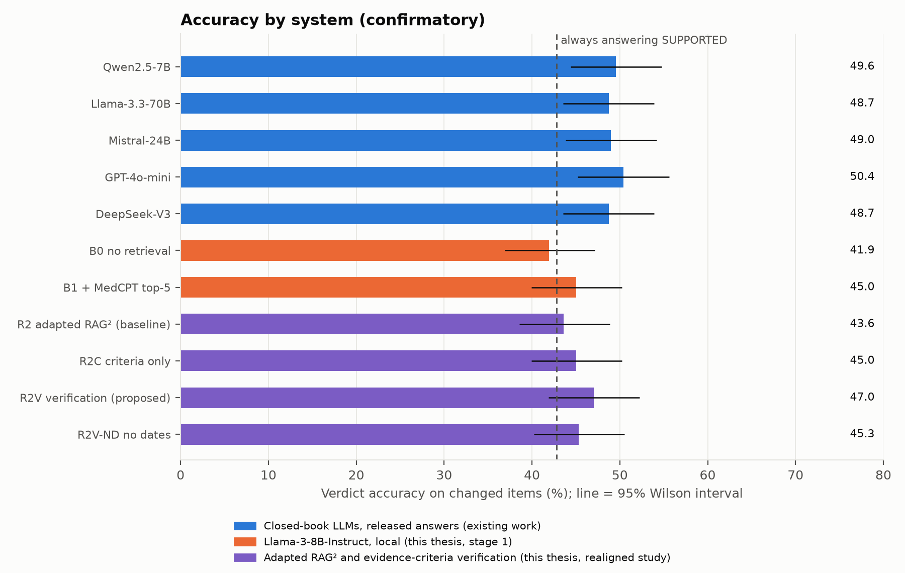
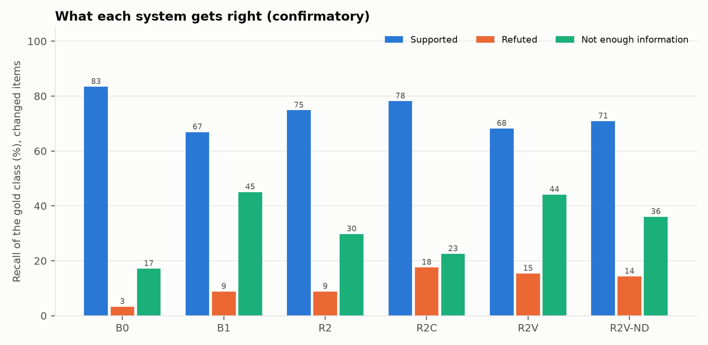

# Results tables and figures: confirm split, confirmatory

Generated by `python -m experiments.medchange.report` from the committed results; nothing here is typed in. Layout follows the base paper (RAG², Sohn et al., NAACL 2025): their Table 2 (systems × benchmark) and Table 3 (one generator, different filtering methods). **The numbers are not comparable with theirs**: this is verdict accuracy (SUPPORTED / REFUTED / NOT ENOUGH INFORMATION against the newest Cochrane review's label), not multiple-choice accuracy, on much smaller samples.

## Table 1. Verdict accuracy (%) of LLMs and RAG variants

| System | Changed (n = 353) | Unchanged (n = 175) | All (n = 528) | 95% CI, all |
|---|---|---|---|---|
| *Closed-book LLMs, released answers (existing work)* | | | | |
| Qwen2.5-7B | 49.6 | **59.4** | **52.8** | 48.6–57.1 |
| Llama-3.3-70B | 48.7 | 54.9 | 50.8 | 46.5–55.0 |
| Mistral-24B | 49.0 | 54.3 | 50.8 | 46.5–55.0 |
| GPT-4o-mini | **50.4** | 57.7 | **52.8** | 48.6–57.1 |
| DeepSeek-V3 | 48.7 | **59.4** | 52.3 | 48.0–56.5 |
| *Llama-3-8B-Instruct, local (this thesis, stage 1)* | | | | |
| B0: Llama-3-8B-Instruct (Q4_K_M), no retrieval | 41.9 | 56.0 | 46.6 | 42.4–50.9 |
| B1: + MedCPT retrieval, top-5 (standard RAG) | 45.0 | 54.3 | 48.1 | 43.9–52.4 |
| *Adapted RAG² and evidence-criteria verification (this thesis, realigned study)* | | | | |
| R2: adapted RAG²: rationale query + type-balanced retrieval + LLM filter (baseline) | 43.6 | 58.9 | 48.7 | 44.4–52.9 |
| R2C: R2's evidence read once with explicit evidence criteria (control) | 45.0 | 55.4 | 48.5 | 44.2–52.7 |
| R2V: R2's answer verified against the evidence criteria (proposed) | 47.0 | 56.0 | 50.0 | 45.8–54.2 |
| R2V-ND: R2V without dates and without the currency criterion (ablation) | 45.3 | 56.6 | 49.1 | 44.8–53.3 |

Closed-book rows are the benchmark authors' own released answers (their prompt, no retrieval) scored on the same questions. Local rows: Meta-Llama-3-8B-Instruct Q4_K_M on CPU, one prompt, greedy decoding. R2 is an adapted RAG², not a reproduction (docs/methodology.md). The requirement is read on R2V − R2 only (RAG2_FINDINGS.md: the difference, its interval and the pre-declared reading); differences between other rows of this table are descriptive, and none is confirmed. The local 8B systems score at or below several closed-book models on these questions, which is context, not a controlled comparison. Bold: best per column.

## Table 2. One generator, different evidence-admission methods

| Method (top-5 passages) | Changed | Δ vs B1 (pp) | 95% CI (pp) | exact McNemar p | Unchanged |
|---|---|---|---|---|---|
| B1: + MedCPT retrieval, top-5 (standard RAG) | 45.0 | — | — | — | 54.3 |
| R2: adapted RAG²: rationale query + type-balanced retrieval + LLM filter (baseline) | 43.6 | -1.4 | -5.9 to +3.1 | 0.6201 | 58.9 |
| R2C: R2's evidence read once with explicit evidence criteria (control) | 45.0 | +0.0 | -5.9 to +5.7 | 1.0000 | 55.4 |
| R2V: R2's answer verified against the evidence criteria (proposed) | 47.0 | +2.0 | -3.4 to +7.1 | 0.5296 | 56.0 |
| R2V-ND: R2V without dates and without the currency criterion (ablation) | 45.3 | +0.3 | -5.1 to +5.7 | 1.0000 | 56.6 |

Differences are against B1 on changed items; p values are uncorrected exact McNemar tests. The pre-stated Holm-corrected comparisons of the realigned study are in `rag2_analysis_confirm.md`.

## Table 3. Where the accuracy comes from (changed items)

| Arm | recall SUPPORTED | recall REFUTED | recall NOT ENOUGH INFORMATION | macro-F1 (%) | answers NOT ENOUGH INFORMATION |
|---|---|---|---|---|---|
| B0: no retrieval | 83% | 3% | 17% | 28.7 | 19% |
| B1: + MedCPT retrieval, top-5 (standard RAG) | 67% | 9% | 45% | 37.6 | 37% |
| R2: adapted RAG²: rationale query + type-balanced retrieval + LLM filter (baseline) | 75% | 9% | 30% | 34.9 | 25% |
| R2C: R2's evidence read once with explicit evidence criteria (control) | 78% | 18% | 23% | 37.4 | 19% |
| R2V: R2's answer verified against the evidence criteria (proposed) | 68% | 15% | 44% | 41.3 | 31% |
| R2V-ND: R2V without dates and without the currency criterion (ablation) | 71% | 14% | 36% | 38.9 | 27% |

## Label reproducibility

An independent model (Qwen2.5-7B-Instruct) re-labelled the gold labels with the authors' rubric: agreement 81.4%, kappa 0.7161, 430 of 528 items label-stable; 72.5% of label changes between versions reproduced. This is reproducibility, not medical truth, and it bounds what any accuracy here can mean.

## Relation to the base paper

RAG² reports +6.9 points on MedQA for Llama-3-8B-Instruct (57.7 → 64.6) using a Flan-T5 filter trained on perplexity-based labels, rationale queries and balanced retrieval over a 564 GB index of four corpora, trained on one H100 GPU. None of that is reproducible here: the trained checkpoint is not distributed, a local retraining attempt (removed from the repository; `docs/log.md` Phases 13–18) learned only the class prior, and the thesis runs on a CPU laptop with a different task (as-of verdict accuracy). What is comparable is the experimental design, a fixed generator with different evidence-admission methods (Table 2) and the comparison with existing systems on identical inputs (Table 1). The closed-book rows are other models answering the same questions without retrieval, so they put the local 8B system in context; they are not a controlled comparison (different sizes, training and prompts). Recency-aware retrieval (TempRALM) corresponds to the stage-1 rows B3 and P.
