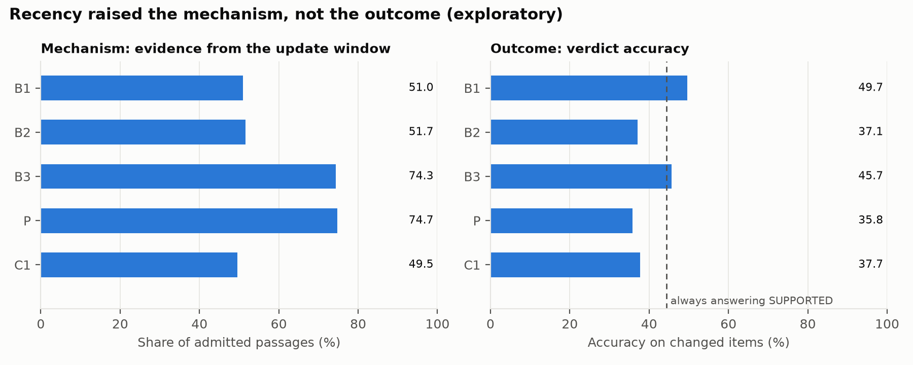
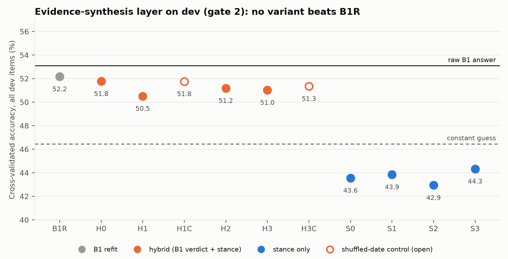

# Results tables and figures: dev split, exploratory

Generated by `python -m experiments.medchange.report` from the committed results; nothing here is typed in. Layout follows the base paper (RAG², Sohn et al., NAACL 2025): their Table 2 (systems × benchmark) and Table 3 (one generator, different filtering methods). **The numbers are not comparable with theirs**: this is verdict accuracy (SUPPORTED / REFUTED / NOT ENOUGH INFORMATION against the newest Cochrane review's label), not multiple-choice accuracy, on much smaller samples.

> **Dev split, exploratory.** These 226 questions were used to design stage 2 and to fit its layer; intervals are wide (about ±6 to ±8 points) and nothing here is a confirmatory finding. The confirmatory split (528 questions) is run once, after the frozen model is committed (`docs/experiment_plan.md`).

## Table 1. Verdict accuracy (%) of LLMs and RAG variants

| System | Changed (n = 151) | Unchanged (n = 75) | All (n = 226) | 95% CI, all |
|---|---|---|---|---|
| *Closed-book LLMs, released answers (existing work)* | | | | |
| Qwen2.5-7B | 49.7 | 56.0 | 51.8 | 45.3–58.2 |
| Llama-3.3-70B | 49.7 | 53.3 | 50.9 | 44.4–57.3 |
| Mistral-24B | **52.3** | 56.0 | 53.5 | 47.0–59.9 |
| GPT-4o-mini | 48.3 | 54.7 | 50.4 | 44.0–56.9 |
| DeepSeek-V3 | 51.0 | **62.7** | **54.9** | 48.4–61.2 |
| *Llama-3-8B-Instruct, local (this thesis, stage 1)* | | | | |
| B0: Llama-3-8B-Instruct (Q4_K_M), no retrieval | 41.1 | 53.3 | 45.1 | 38.8–51.6 |
| B1: + MedCPT retrieval, top-5 (standard RAG) | 49.7 | 60.0 | 53.1 | 46.6–59.5 |
| B2: + zero-shot helpfulness filter (untrained RAG²-style stand-in) | 37.1 | 61.3 | 45.1 | 38.8–51.6 |
| B3: + recency re-ranking (TempRALM-style) | 45.7 | 58.7 | 50.0 | 43.5–56.5 |
| P: + helpfulness + recency (stage-1 Temporal Filter) | 35.8 | 58.7 | 43.4 | 37.1–49.9 |
| C1: + helpfulness + shuffled dates (control) | 37.7 | 61.3 | 45.6 | 39.2–52.1 |
| *Evidence-synthesis layer (stage 2; out-of-fold on dev)* | | | | |
| B1R: B1 verdict through the same fitting | 49.7 | 60.0 | 53.1 | 46.6–59.5 |
| S0: stance only | 41.1 | 49.3 | 43.8 | 37.5–50.3 |
| H0: hybrid: B1 verdict + stance | 49.7 | 57.3 | 52.2 | 45.7–58.6 |
| H1: hybrid + recency weights | 47.7 | 57.3 | 50.9 | 44.4–57.3 |
| H2: hybrid + study-type weights | 48.3 | 57.3 | 51.3 | 44.8–57.8 |
| H3: hybrid + both weights | 49.0 | 57.3 | 51.8 | 45.3–58.2 |
| H1C: H1 with shuffled dates (control) | 49.0 | 56.0 | 51.3 | 44.8–57.8 |
| H3C: H3 with shuffled dates (control) | 48.3 | 56.0 | 50.9 | 44.4–57.3 |

Closed-book rows are the benchmark authors' own released answers (their prompt, no retrieval) scored on the same questions. Local rows: Meta-Llama-3-8B-Instruct Q4_K_M on CPU, one prompt, greedy decoding. Stage-2 rows on dev are out-of-fold predictions (majority over 50 repeated cross-validation runs), not tests, and can differ slightly from the mean cross-validated accuracy of Table 4 (B1R: 53.1 here, 52.2 there). Bold: best per column. B2/P/C1 use an untrained zero-shot Flan-T5 helpfulness score, **not** RAG²'s trained filter (its checkpoint is not distributed); for 18.5% of its inputs the question was cut off by truncation (`docs/log.md`, Phase 28).

## Table 2. One generator, different evidence-admission methods

| Method (top-5 passages) | Changed | Δ vs B1 (pp) | 95% CI (pp) | exact McNemar p | Unchanged |
|---|---|---|---|---|---|
| B1: + MedCPT retrieval, top-5 (standard RAG) | 49.7 | — | — | — | 60.0 |
| B2: + zero-shot helpfulness filter (untrained RAG²-style stand-in) | 37.1 | -12.6 | -19.9 to -5.3 | 0.0013 | 61.3 |
| B3: + recency re-ranking (TempRALM-style) | 45.7 | -4.0 | -11.3 to +3.3 | 0.3771 | 58.7 |
| P: + helpfulness + recency (stage-1 Temporal Filter) | 35.8 | -13.9 | -21.9 to -6.6 | 0.0008 | 58.7 |
| C1: + helpfulness + shuffled dates (control) | 37.7 | -11.9 | -19.9 to -4.0 | 0.0051 | 61.3 |

Differences are against B1 on changed items; p values are uncorrected exact McNemar tests. The pre-stated Holm-corrected family (P vs B1, B2, B3) is in `analysis_dev.json`.

## Table 3. Where the accuracy comes from (changed items)

| Arm | recall SUPPORTED | recall REFUTED | recall NOT ENOUGH INFORMATION | macro-F1 (%) | answers NOT ENOUGH INFORMATION |
|---|---|---|---|---|---|
| B0: no retrieval | 81% | 3% | 15% | 27.2 | 21% |
| B1: + MedCPT retrieval, top-5 (standard RAG) | 69% | 11% | 53% | 41.9 | 40% |
| B2: + zero-shot helpfulness filter (untrained RAG²-style stand-in) | 73% | 0% | 15% | 23.6 | 23% |
| B3: + recency re-ranking (TempRALM-style) | 58% | 8% | 57% | 38.4 | 48% |
| P: + helpfulness + recency (stage-1 Temporal Filter) | 63% | 0% | 26% | 25.1 | 32% |
| C1: + helpfulness + shuffled dates (control) | 67% | 0% | 26% | 26.1 | 32% |
| H0: hybrid H0 | 69% | 14% | 51% | 42.8 | 36% |

## Table 4. Evidence-synthesis layer, dev cross-validation (gate 2)

Repeated 5-fold cross-validation, 50 repeats, on the 226 dev items; constant-guess accuracy 46.5%.

| Variant | accuracy (all) | accuracy (changed) | recall S | recall R | recall NEI |
|---|---|---|---|---|---|
| B1R | 52.2 | 48.6 | 74% | 7% | 52% |
| H0 | 51.8 | 49.0 | 75% | 11% | 47% |
| H1 | 50.5 | 47.1 | 74% | 9% | 45% |
| H1C | 51.8 | 49.1 | 75% | 10% | 47% |
| H2 | 51.2 | 48.0 | 75% | 11% | 44% |
| H3 | 51.0 | 47.6 | 74% | 10% | 45% |
| H3C | 51.3 | 48.3 | 75% | 10% | 45% |
| S0 | 43.6 | 40.8 | 88% | 6% | 5% |
| S1 | 43.9 | 41.6 | 90% | 2% | 6% |
| S2 | 42.9 | 39.4 | 85% | 5% | 7% |
| S3 | 44.3 | 42.4 | 90% | 3% | 6% |

Gate 2: **FAIL**; FAIL S0_cv_accuracy>constant_prior; FAIL selected_hybrid_minus_B1R>=+1.0pp; PASS stance_auc>=0.60.

## Label reproducibility

An independent model (Qwen2.5-7B-Instruct) re-labelled the gold labels with the authors' rubric: agreement 83.2%, kappa 0.7422, 188 of 226 items label-stable; 68.2% of label changes between versions reproduced. This is reproducibility, not medical truth, and it bounds what any accuracy here can mean.

## Relation to the base paper

RAG² reports +6.9 points on MedQA for Llama-3-8B-Instruct (57.7 → 64.6) using a Flan-T5 filter trained on perplexity-based labels, rationale queries and balanced retrieval over a 564 GB index of four corpora, trained on one H100 GPU. None of that is reproducible here: the trained checkpoint is not distributed, a local retraining attempt (archived) learned only the class prior, and the thesis runs on a CPU laptop with a different task (as-of verdict accuracy). What is comparable is the experimental design, a fixed generator with different evidence-admission methods (Table 2) and the comparison with existing systems on identical inputs (Table 1).
